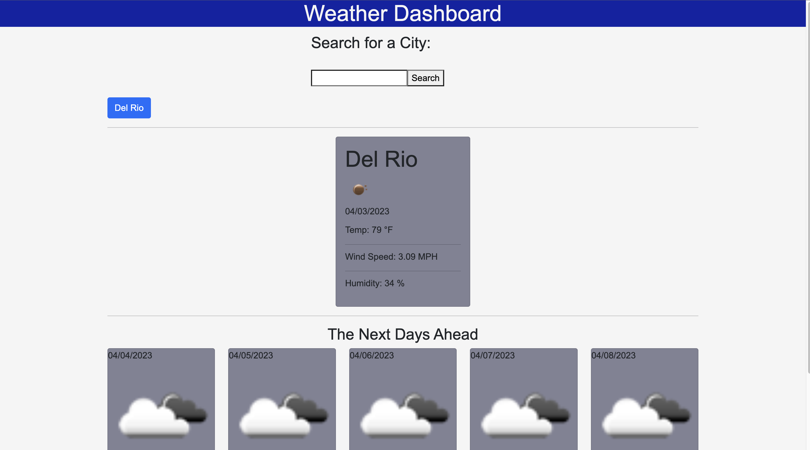

# weatherForcaster
## Description
This weather forecaster displays the current city's day forecasr using a third-party API called OpenWeather. It shows the current temperature, wind speed, and humidity that allows you to save data in the local storage, along with the next five day forecast. Local Storage allows to view the 5 past cities searched.

## URL
https://annaleebeltran.github.io/weatherForcaster/

## Usage

weatherForecaster implements third party API to view current city stats along with the next 5-days.

## License

Please refer to the LICENSE in the Scheduler repository.